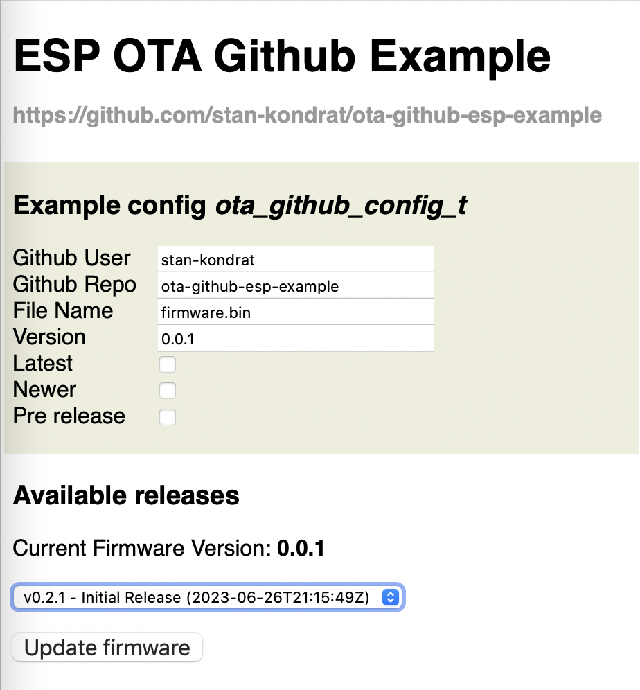

# Esp32 Over-The-Air(OTA) Github IDF Component Example



## Components
- [ota-github-esp-component](https://github.com/stan-kondrat/ota-github-esp-component) - parse github releases
- [ota-esp-component](https://github.com/stan-kondrat/ota-esp-component) - install esp ota

## Development

Github Releases API 
```sh
curl -L \
  -H "Accept: application/vnd.github+json" \
  -H "X-GitHub-Api-Version: 2022-11-28" \
  https://api.github.com/repos/stan-kondrat/ota-github-esp-example/releases

curl -L \
  -H "Accept: application/vnd.github+json" \
  -H "X-GitHub-Api-Version: 2022-11-28" \
  https://api.github.com/repos/stan-kondrat/ota-github-esp-example/releases/latest
```

Formating
```sh
find ./main -iname "*.h" -o -iname "*.c" | xargs clang-format -style=file -i
```